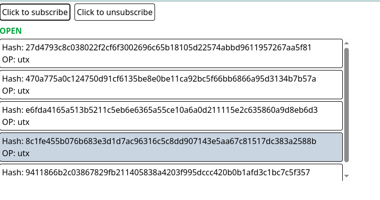

## React Websocket hook

This is a basic project to explore the use of websockets in react and creating a use hook to interact with it. The hook is located under folder `/hooks` and a demo app uses a websocket API from https://www.blockchain.com/explorer/api/api_websocket.

## Screenshots

